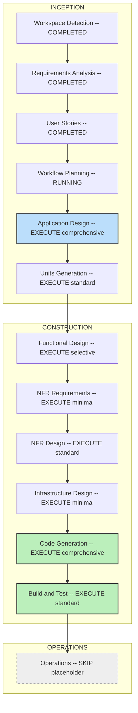

# Execution Plan — okc-web

okc-web는 Obsidian Vault 통합 웹 플랫폼(GREENFIELD, 해커톤 PoC, 수상 목표)이며, Rust+axum이 okc-interop crate를 직접 링크(path dep)하고 Next.js+Tailwind+shadcn/Tremor 프런트엔드로 서빙한다. 본 계획은 3개 렌즈(demo-velocity / judging-criteria / engineering-correctness)를 조정하여 도출한 단일 권위 실행 계획이다.

## Detailed Analysis Summary

### Change Impact Assessment
- **User-facing 변경**: Yes — 로그인/RBAC, 토큰 업로드, 통합 체크포인트 스테퍼, E4 충돌/크리틱 리뷰(focal wow), E5 provenance/verify(focal wow) 등 전 화면이 신규.
- **Structural 변경**: Yes — 단일 장기 실행 엔진 프로세스 + okc-interop 어댑터 경계(ADR-0002), 프로세스-글로벌 scheduler/PROJECT_RESERVATIONS를 감싸는 in-process 단일-writer 직렬화 큐가 신규 구조.
- **Data-model 변경**: Yes — 계정/세션, 업로드/서빙 토큰(해시 저장), curator-decision append-only 감사 저장소, 해시 바인딩된 승인 상태(freeze-then-run). okc-core 도메인 모델은 불변(어댑터만).
- **API 변경**: Yes — 전량 신규(C-5/C-7): HTTP/업로드/토큰/서빙/RAG. 결과는 typed DTO interop schema v2로 수신, okc-mcp는 read-only contract-only.
- **NFR 변경**: Yes(경량) — 스택 확정. 동시성 직렬화(NFR-CONC-1), 해시 시크릿(NFR-SEC-1), commit-pin+CI(NFR-PORT-1), 구조적 로깅/관측성(C6), 설정 분리가 대상. Security/Resiliency/PBT 확장은 opt-out.

### Risk Assessment
- **Overall Risk Level**: High.
- **핵심 리스크**: (1) 미공개 okc-core 0.3.0 dev-tree를 direct path dep로 링크 → commit-pin + CI 소스 빌드 필수(미핀 시 C4 자동 실패). (2) C3 유일 차별자(req-3 경우 B: approve/waive/omission/regenerate → approve_cluster/regenerate_cluster, okc-core 무수정)는 design+code 검증 필요(주장만이면 0점). (3) 프로세스-글로벌 statics로 인한 단일-writer 직렬화/PROJECT_BUSY 큐잉. (4) 해시 바인딩 staleness 캐스케이드(C-4). (5) 적대적 업로드(zip-bomb/path-traversal/symlink) pre-landing 검증.
- **Rollback 전략**: greenfield이므로 프로덕션 롤백 개념 없음; 유닛별 브랜치 + 커밋 단위 복구, okc-core commit-pin 고정으로 상류 churn 격리, no-clobber compile로 서빙 산출물 안전.
- **Testing 복잡도**: Medium — 정합성 불변식 단위 테스트(403-never-calls-core, OkcError code 분기, schema-version 거부, staleness 캐스케이드, 업로드 거부) + 단일-writer/PROJECT_BUSY 통합 테스트 1건 + 데모 e2e 1건. perf/load/property 스위트는 제외(데모 스케일, PBT opt-out).

## Workflow Visualization

### Text Alternative
- INCEPTION
  1. Workspace Detection — COMPLETED
  2. Requirements Analysis — COMPLETED
  3. User Stories — COMPLETED
  4. Workflow Planning — RUNNING (현재 단계)
  5. Application Design — EXECUTE (comprehensive)
  6. Units Generation — EXECUTE (standard)
- CONSTRUCTION (유닛별 루프)
  7. Functional Design — EXECUTE (selective: U3/U4 comprehensive, U1/U2 standard, U5/U6 skip)
  8. NFR Requirements — EXECUTE (minimal)
  9. NFR Design — EXECUTE (standard)
  10. Infrastructure Design — EXECUTE (minimal)
  11. Code Generation — EXECUTE (comprehensive) — ALWAYS, 유닛별
  12. Build and Test — EXECUTE (standard) — 모든 유닛 완료 후
- OPERATIONS
  13. Operations — SKIP (placeholder)

## Phases to Execute

### INCEPTION
- [EXECUTE] **Application Design** — depth: comprehensive
  - Rationale: 3개 렌즈 만장일치 EXECUTE. C1/C2/C3/C5/C6가 물리적으로 착지하는 최고 레버리지 단계. ADR-0002 어댑터 경계, RBAC 게이트가 okc-interop 호출 앞에 위치함, 단일 장기 프로세스+직렬화 큐 토폴로지, typed-DTO schema-version 가드, 그리고 유일한 C3 차별자인 경우-B 결정 표면 매핑을 코드 이전에 확정. UI는 ui-screens.md/design-system.md로 선착수돼 있으므로 UI는 경량, 서비스/컴포넌트 계약과 E4/E5 focal 화면 설계에 comprehensive 집중. aidlc-state의 "running" dangling 상태도 여기서 실제 산출물로 해소.
- [EXECUTE] **Units Generation** — depth: standard
  - Rationale: 3개 렌즈 EXECUTE. 프로세스-글로벌 scheduler/PROJECT_RESERVATIONS 때문에 정확히 하나의 유닛이 엔진 프로세스를 소유하고 모든 mutating flow를 큐로 깔때기해야 하므로 분해가 load-bearing. 5 epic + 공유 어댑터로 seam이 이미 대부분 결정돼 있어 comprehensive 불필요, story-ID 키잉으로 C1/C6 추적성 확보(standard).

### CONSTRUCTION (per-unit loop)
- [EXECUTE] **Functional Design** — depth: selective (U3/U4 comprehensive · U1/U2 standard · U5/U6 skip)
  - Rationale: 실제 okc-web 비즈니스 로직/모델을 소유한 유닛에만 선택 실행. U4 리뷰(경우-B 결정 표면, Major/Critical 비-waivable/Minor waive+rationale, 모순 보존, APPROVAL_REQUIRED compile 거부)와 U3 오케스트레이션(IntegrationCheckpoint 상태머신, 해시 바인딩 staleness 캐스케이드)은 정합성 코어+C3 차별자이므로 comprehensive. U1 auth/token, U2 업로드 검증/데이터모델은 standard. U5 서빙(파일 read)·U6 프런트(프레젠테이션, UI 선착수)는 skip. ADR-0002상 무거운 정책 로직은 okc-core가 소유하므로 재설계 금지.
- [EXECUTE] **NFR Requirements** — depth: minimal
  - Rationale: 2/3 렌즈 EXECUTE. 스택 확정(axum+okc-interop path-dep)이고 NFR은 requirements.md에 이미 열거(NFR-CONC-1/SEC-1/PERF-1/PORT-1/AVAIL-1)돼 신규 elicitation 불필요. 그러나 직렬화 NFR은 미할당하기엔 너무 load-bearing하고, C6 채점(구조적 로깅/관측성, 설정 분리, 시크릿 위생)이 있으므로 SKIP 대신 minimal로 실행: 기존 NFR을 소유 유닛에 바인딩 + 로깅/config-separation/secret-hygiene를 명문화.
- [EXECUTE] **NFR Design** — depth: standard
  - Rationale: 2/3 렌즈 EXECUTE. 최고가치 정합성 패턴이 구체화되는 지점: in-process 단일-writer 큐, PROJECT_BUSY retry/queue, 해시 바인딩 staleness 탐지+캐스케이드 무효화, OkcError code/category 분기(메시지 파싱 금지), schema-version 거부, publish barrier 전 취소, 해시 시크릿 저장(argon2/bcrypt), 스트리밍 업로드 검증 파이프라인. Resiliency Baseline opt-out이므로 comprehensive는 과함 → standard.
- [EXECUTE] **Infrastructure Design** — depth: minimal
  - Rationale: 렌즈 분할(2 SKIP / 1 minimal). 로컬 단일 프로세스 PoC라 클라우드/배포 토폴로지는 사실상 없음. 그러나 Gate 5 항목(okc-core commit-pin+소스 빌드 단계=C4 재현 빌드, names-only .env.example+provider env-var 목록=C5 시작 경로/C6 시크릿 위생, 단일 config manifest)은 저비용·judge-visible 증거이므로 "저비용 judge-visible이면 EXECUTE" 규칙에 따라 minimal로 실행. 인프라를 발명하지 않고 이 필수 항목만 포착.
- [EXECUTE] **Code Generation** — depth: comprehensive — ALWAYS, per-unit
  - Rationale: 3개 렌즈 EXECUTE. C4(actually-works, 최고 가중, 하드 게이트)가 여기서 승부. axum+Next 엔트리포인트, 커밋된 lockfile, 실제 okc-interop 배선(add_source/approve_taxonomy/approve_cluster/regenerate_cluster/compile/verify/explain — 모킹 금지), RBAC-before-core 미들웨어, APPROVAL_REQUIRED compile 거부, no-clobber 서빙, 글로벌 에러 핸들러, 22 Must 데모 스파인에 stub/TODO 금지. Should-only(E2-S6/E3-S5/E4-S5/E5-S5)는 경량 stub/deferred. Part 1 체크박스 계획으로 C1 추적성 유지.
- [EXECUTE] **Build and Test** — depth: standard (하드-MUST exit artifact 강제)
  - Rationale: 렌즈 분할(minimal/comprehensive/standard)을 standard로 조정. PBT opt-out이라 comprehensive 테스트 티어는 과함이지만, 해커톤 하드-MUST 산출물은 여기서만 나오므로 필수 exit artifact로 예약: **screenshots/ 또는 result/** (E4 리뷰, E2 토큰 업로드, E5 provenance/verify, 403 게이트 — 누락 시 C4 자동 실패), both-stack CI, okc-core commit-pin 빌드, 루트 README(features=스크린샷, okc-mcp contract-only, Problem Statement 축자), 리포 루트 AI-DLC PROCESS narrative(C1), secret scan + 커밋된 lockfile(C6). 테스트는 정합성 불변식 단위 + 단일-writer/PROJECT_BUSY 통합 1건 + 데모 e2e로 한정.

### OPERATIONS
- [SKIP] **Operations** — depth: n/a
  - Rationale: 워크플로 상 placeholder. 로컬 단일 프로세스 PoC로 배포/모니터링 토폴로지가 범위 밖. 모든 빌드/테스트 활동은 Construction의 Build and Test가 흡수.

## Recommended Unit Decomposition
리스크-우선 빌드 순서(U0 → U1 → U2 → U3 → U4 → U5), U6 프런트 인터리브. 모든 유닛 story-ID/FR 키잉(C1/C6 추적성).

- **U0 — Platform & okc-interop Adapter** (공유 기반, 최우선): 단일 격리 okc-interop 어댑터(OkcClient/Project/Job 래핑, typed-DTO interop schema v2 경계, schema-version 가드), 단일 장기 엔진 프로세스 + in-process 단일-writer 직렬화/PROJECT_BUSY 큐, okc-core commit-pin 소스 빌드, 횡단 관심사: 단일 authz 가드 미들웨어, 단일 OkcError→HTTP 매핑, 재사용 업로드 입력검증 모듈, curator-decision append-only 감사 저장소, 구조적 로깅/correlation-id. (Cross-cutting; E3/E4 기반, C-1/C-4/C-5/FR-INT-8/NFR-CONC-1/PORT-1)
- **U1 — Auth & RBAC** (E1, S1-S5): 계정/로그인/세션/토큰, admin/contributor 역할 모델, mutating-op admin-only 게이팅 배선(core 호출 전), curator_id 라벨 바인딩(비검증), salted/KDF 시크릿 해시. (C-1)
- **U2 — Upload & Token** (E2, S1-S6): 토큰 발급/목록/폐기(1회 표시), token-auth 업로드 엔드포인트, byte/format/path-safety(zip-bomb/traversal/symlink) pre-landing 검증, 로컬 landing + add_source(owner_display_name, ≤10 cap), contributor 피드백. (C-3, E2-S4)
- **U3 — Integration Orchestration** (E3, S1-S7): 프로젝트 생성, 소스 freeze(≤10), IntegrationCheckpoint 루프 셸(NeedsProvider→Disclosure→Taxonomy→Clusters→ReadyToCompile) + run 직렬화 큐, provider/remote-disclosure 동의(env-var-name only), stale-invalidation UX, no-clobber compile, job 진행/에러. (C-3/C-4/C-6)
- **U4 — Conflict/Critic Review** (E4, S1-S6 — C3 차별자 + focal wow, 우선): taxonomy approve, synthesis/critic severity 리뷰, approve_cluster + Minor waive/omission(rationale), regenerate_cluster, 모순 보존 표시(ADR-0024, winner-select 금지), APPROVAL_REQUIRED compile 거부 게이트. (C-2/C3)
- **U5 — Serving & okc-mcp Contract** (E5, S1-S5 — focal wow): read-only vault list/body, verify()/explain() provenance, discovery/contract 엔드포인트, manifest 해시 바인딩 + stale 라벨. (C-6/C-7, contract-only)
- **U6 — Frontend** (전 화면, 전 story-ID): checkpoint 스테퍼, E4/E5 focal 화면, empty/loading/success/error 상태 매트릭스, in-screen helper + 문제정의 카피. UI 선착수(ui-screens.md/design-system.md) 위에 배선, 마지막 폴리시. (C5)

## Per-Stage Judging-Criteria Gate

| 실행 단계 | C1 협업 진정성 | C2 문제정의 | C3 차별화 | C4 actually-works | C5 온보딩/사용성 | C6 유지보수성 |
|---|---|---|---|---|---|---|
| Application Design (comp.) | 화면→story-ID 매트릭스 | landing/empty 카피 | 경우-B 결정표면 설계 | N/A | E4/E5 focal + 상태 매트릭스 | epic-정렬 모듈 맵 |
| Units Generation (std.) | story-ID 키드 유닛 | N/A | 어댑터 격리 seam | N/A | N/A | 5-epic 모듈 분할 |
| Functional Design (sel.) | 결정 로직 추적 | N/A | severity 게이팅 로직 | 상태머신 정확성 | 에러→메시지→next-action 카탈로그 | curator 감사 저장소 |
| NFR Requirements (min.) | N/A | N/A | N/A | N/A | 시작 경로 요건 | 로깅/config/시크릿 명문화 |
| NFR Design (std.) | N/A | N/A | N/A | OkcError→HTTP 매핑 | N/A | 로깅/correlation, KDF, 큐 |
| Infrastructure Design (min.) | N/A | N/A | N/A | commit-pin 재현 빌드 | .env.example 시작 경로 | config manifest/시크릿 위생 |
| Code Generation (comp.) | 모듈 story-ID 태깅 | N/A | 실 okc-interop 배선 검증 | 실행 코드, no-stub 스파인 | 상태 처리 구현 | RBAC-before-core, 에러 핸들러 |
| Build and Test (std.) | AI-DLC PROCESS narrative | README Problem Statement | 실 파이프라인 캡처 | screenshots/·CI·lockfile·e2e | README/스크린샷 일관성 | secret scan, lockfile |

## Estimated Timeline
해커톤 상대 순서(캘린더 아님):
1. **Phase 0 — 설계 확정 (INCEPTION 마무리)**: Application Design(comp.) → Units Generation(std.). 어댑터 경계 + 경우-B 결정표면 + 유닛 순서 확정.
2. **Phase 1 — 기반 유닛**: U0(어댑터/큐/횡단) — okc-core commit-pin CI 빌드 그린 확인. 최고 리스크 선차단.
3. **Phase 2 — 데모 스파인 백엔드**: U1 → U2 → U3 (Functional/NFR 설계는 U3/U4에 comprehensive로 인터리브).
4. **Phase 3 — Wow 코어**: U4(E4 리뷰) — 실 크리틱 데이터로 coverage_ok false→true 재생, U5(E5 provenance/verify).
5. **Phase 4 — 프런트 폴리시**: U6 화면 배선 + 상태 매트릭스, E4/E5 focal 폴리시.
6. **Phase 5 — Build and Test**: 빌드/CI/lockfile, 데모 e2e, screenshots/ 캡처, README + PROCESS narrative, secret scan.

## Success Criteria
- **Primary Goal**: 22 Must 스토리의 데모 스파인이 실제 okc-interop 데이터로 end-to-end 동작하고, E4(충돌/크리틱, winner-select 없음·Major/Critical 비-waivable) 및 E5(provenance/verify) focal 화면이 실 파이프라인 산출물을 렌더 → C3 구조적 차별화가 코드/설계로 검증됨.
- **Key Deliverables**: (1) 실행되는 axum+Next 앱 + 커밋된 lockfile + 엔트리포인트; (2) okc-core commit-pin + both-stack CI 그린; (3) RBAC-before-core 게이트 + 글로벌 OkcError 핸들러; (4) in-process 단일-writer/PROJECT_BUSY 큐; (5) 루트 README(features=스크린샷, Problem Statement 축자, okc-mcp contract-only) + AI-DLC PROCESS narrative.
- **Quality Gates**: 데모 스파인 stub/TODO 0 (C4); **screenshots/ 또는 result/에 실 실행 캡처(E4 리뷰·E2 토큰 업로드·E5 verify·403 게이트) — 하드 MUST, 누락 시 C4 실패**; 정합성 불변식 단위 테스트(403-never-calls-core·OkcError code 분기·schema-version 거부·staleness 캐스케이드·업로드 거부) 통과; 단일-writer/PROJECT_BUSY 통합 1건 + 데모 e2e 1건 통과; secret 하드코딩 0 (provider creds는 env-var-name only); 각 완료 게이트에서 6-criteria self-check + state↔disk 정합 재조정.
