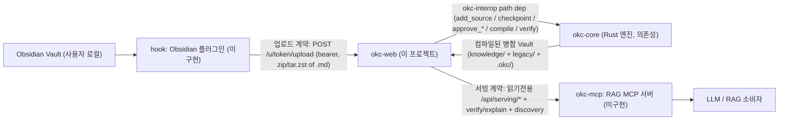

# Module Integration Guide — okc-web ↔ okc-core · okc-mcp · Obsidian hook

**목적**: okc-web을 형제 모듈(okc-core, okc-mcp, Obsidian hook 플러그인)과 **단일 모노레포**로 합칠 때 참조하는 핸드오프 문서. 각 모듈의 경계·계약·합치기 절차·현재 상태를 한 곳에 모은다.
**대상 독자**: 나중에 repo를 합치고 통합 데모를 세팅할 개발자(= 미래의 나/팀).
**상태**: 초판 (2026-09-08). 외부 계약·모노레포 레이아웃은 안정. **okc-web 내부 컴포넌트 상세는 Application Design 산출물**(`aidlc-docs/inception/application-design/`)로 보강 예정.
**결정 근거**: repo-merge = 모노레포 · hook = Obsidian 플러그인 (사용자 확정 2026-09-08). 계약 근거는 `requirements.md`(FR-UP/SRV), `ui-screens.md`(E2/E5), `decision-records.md`, `okc-core-capability-analysis.md`.

---

## 1. 모듈 생태계 (Module Map)



### 텍스트 대안 (다이어그램 동일 내용)
- **Obsidian Vault** → **hook(Obsidian 플러그인)**: 로컬 Vault 이벤트 감지.
- **hook** → **okc-web**: 업로드 계약 — `POST /u/{token}/upload` (bearer 토큰, `.md` 디렉터리의 zip/tar.zst).
- **okc-web** → **okc-core**: `okc-interop` path dep 직접 링크 — add_source / checkpoint / approve_taxonomy / approve_cluster / regenerate_cluster / compile / verify / explain.
- **okc-core** → **okc-web**: 컴파일된 병합 Vault 디렉터리(`knowledge/` + `legacy/` + `.okc/`) 반환.
- **okc-web** → **okc-mcp**: 서빙 계약 — 읽기전용 `/api/serving/*` + provenance(verify/explain) + discovery/contract 엔드포인트.
- **okc-mcp** → **RAG 소비자**: 청킹·임베딩·vector index·쿼리(okc-mcp 소관, okc-web 범위 밖).

**데이터 파이프라인 한 줄 요약**: Obsidian Vault → hook → okc-web 업로드 → okc-core add_source → 통합/리뷰/컴파일 → okc-web 서빙 → okc-mcp RAG.

---

## 2. 소유 · 경계 (Ownership & Boundaries)

| 모듈 | 언어/런타임 | 역할 | okc-web과의 관계 | 상태 |
|---|---|---|---|---|
| **okc-core** | Rust (workspace v0.3.0) | Vault 컴파일 엔진(인제스트·AI 파이프라인·critic/curator 게이트·모순 보존·compile/verify/explain) | okc-web이 `okc-interop`을 **path dep로 직접 링크**. **수정 금지**(ADR-0002). commit-pin. | 기존 |
| **okc-web** | Rust(axum) + Next.js | 플랫폼: 인증/RBAC, 토큰 업로드, 통합 오케스트레이션, conflict/critic 리뷰, 서빙 | (본체) | 설계 중 |
| **okc-mcp** | (미정) | 병합 Vault를 RAG 소스로 소비(청킹/임베딩/vector index/쿼리, MCP 툴 표면) | okc-web **서빙 계약의 소비자**. okc-web은 소스 제공까지만. | 미구현(계약만) |
| **hook** | TypeScript (Obsidian 플러그인) | 로컬 Obsidian Vault 이벤트 감지 → okc-web으로 자동 업로드 | okc-web **업로드 계약의 생산자**(클라이언트). | 미구현(계약만) |

**핵심 원칙**
- **RBAC/인증은 100% okc-web**: okc-core는 호출자를 인증하지 않는다(C-1). hook은 *업로드 토큰*만, admin은 *세션*으로 인증.
- **okc-core 무수정**(ADR-0002): 신규 public API 추가 금지, 기존 표면만 소비.
- **모순 보존, 승자 선택 없음**(C-2, ADR-0024): 리뷰는 승인/waive/omission/regenerate 결정 표면(경우 B). `decision-records.md` 참조.
- **로컬 우선**: 업로드는 디스크 착지 후 add_source(C-6); 컴파일 산출물은 로컬 디렉터리.

---

## 3. 크로스-모듈 계약 (Contracts)

> 이 세 계약이 모노레포 합치기의 **연결 지점**이다. 각 모듈은 이 계약만 지키면 독립 개발 가능.

### 3.A okc-web ↔ okc-core (내부, 컴파일 타임 링크)
- **연결 방식**: okc-web(Rust) 백엔드가 `okc-interop` 크레이트를 **path dependency**로 링크(JSON 왕복 없음, 타입드).
- **경계**: okc-web은 `trait OkcEngine` 뒤에서만 okc-interop을 사용(하나의 concrete impl이 래핑). 나머지 모듈은 okc-web 자체 typed-DTO(interop schema v2)에만 의존. → schema-version 가드 단일 지점.
- **소비 API(검증 필요)**: `add_source`, `approve_taxonomy`, `approve_cluster`, `regenerate_cluster`, `compile`/`compile_latest`, `verify`, `explain`, `checkpoint`. (Application Design 검증 단계에서 okc-core 코드로 시그니처 확인.)
- **버전 고정**: okc-core를 **특정 commit에 핀**하고 CI에서 소스 빌드(NFR-PORT-1). 핀 해시는 U0 착수 시 확정(미정). 출력은 **Markdown 전용**.
- **동시성**: okc-interop scheduler·PROJECT_RESERVATIONS는 프로세스-글로벌 statics → okc-web이 **단일 장기 프로세스 + in-process 단일-writer 큐**로 직렬화(cross-process 락은 `project.lock`).

### 3.B hook(Obsidian 플러그인) → okc-web (업로드 계약)
- **엔드포인트**: `POST /u/{token}/upload` — 로그인 불필요, **업로드 토큰(bearer)** 만으로 인증(FR-UP-2).
- **토큰 발급**: admin이 okc-web에서 프로젝트-슬롯별 토큰 발급(1회성 평문 노출, 저장은 해시). 화면 E2-1/E2-2. hook은 이 토큰을 설정에 저장.
- **페이로드**: 디렉터리 zip 또는 tar.zst, **Markdown 중심 콘텐츠**. okc-web이 검증(허용 포맷·크기 상한·경로/심볼릭 링크 안전성·zip-bomb; FR-UP-3) 후 로컬 착지 → `add_source(owner_display_name, ...)`로 등록(FR-UP-4).
- **응답/상태**: 수락/거부(만료·폐기·무효 토큰·검증 실패 사유), 등록 결과. 화면 E2-4/E2-5.
- **제약**: 프로젝트당 소스 ≤10(C-3). hook은 재업로드 정책(전체 교체)에 유의.
- **hook 구현 시 필요한 것(미래)**: okc-web base URL + 업로드 토큰 설정, Vault 폴더 → 아카이브 패키징, 변경 감지(디바운스), 업로드 상태 표시. (okc-web은 이 계약만 노출하면 됨.)

### 3.C okc-web → okc-mcp (서빙 계약)
- **컴파일 산출물**: 병합 Vault 디렉터리 = `knowledge/`(합성 노트) + `legacy/`(원본 보존) + `.okc/`(provenance/manifest). no-clobber(FR-INT-7).
- **읽기전용 API**: `/api/serving/*` — 파일 목록·본문 조회(FR-SRV-1). UI 없음, okc-mcp가 소비.
- **Provenance/무결성**: `verify()` / `explain()` 노출(FR-SRV-2, NFR-DET-1). *검증 = 내부 일관성 증명이지 발행자 진위 보증 아님*을 명시.
- **Discovery/계약 엔드포인트**: okc-mcp가 소비할 위치(로컬 디렉터리 경로 **또는** read API 엔드포인트)와 형식을 기술(FR-SRV-3). 화면 E5-4.
- **manifest 해시 바인딩 + stale 라벨**: 상류 변경 시 이전 승인·산출물이 stale임을 표시(C-4).
- **범위 경계**: RAG 리트리벌 전체(청킹·임베딩·vector index·쿼리, MCP 툴 표면)는 **okc-mcp 소관**. okc-core 임베딩은 일시적 → okc-mcp가 산출물을 **재임베딩**해야 함.

---

## 4. 모노레포 타깃 레이아웃 (제안)

> CONSTRUCTION에서 확정. okc-core는 **핀된 외부 의존성으로 유지**를 권장(공동 개발이면 vendor).

```text
<monorepo-root>/
├── okc-core/                 # Rust 엔진 (핀된 의존성; submodule 또는 vendored)
├── okc-web/                  # 이 프로젝트
│   ├── backend/              # axum 크레이트 (okc-interop path dep → ../../okc-core/...)
│   │   └── src/{adapter,auth,upload,orchestration,review,serving,shared}/
│   ├── frontend/             # Next.js App Router (shadcn/Tremor)
│   └── aidlc-docs/           # 본 문서 포함 AI-DLC 산출물
├── okc-mcp/                  # RAG MCP 서버 (okc-web 서빙 계약 소비)
├── obsidian-hook/            # Obsidian 플러그인 (okc-web 업로드 계약 생산)
├── .github/workflows/        # 공유 CI: okc-core 핀 빌드 + okc-web(백/프론트) + (mcp/hook)
├── .env.example              # 이름만(값 없음) — provider env-var, 경로, 포트
└── README.md                 # 통합 개요 + 각 모듈 링크 + Problem Statement
```

**okc-core 편입 방식(선택)**
- **권장**: git submodule 또는 vendored 소스로 **핀 유지**(okc-web은 소비자, 공동 개발 아님) → 상류 churn 격리.
- 대안: 완전 편입(모노레포에서 함께 개발) → okc-core도 수정 대상이 되면 ADR-0002 재검토 필요.

---

## 5. 공유 관심사 (Shared Concerns)

- **설정 분리**: 각 모듈 `.env`(값 커밋 금지) + 루트 `.env.example`(이름만). provider 자격증명은 **env-var 이름으로만**(A-2, C6 시크릿 위생).
- **버전/계약 안정성**: interop schema v2(okc-web↔okc-core)와 서빙 계약(okc-web↔okc-mcp)·업로드 계약(hook↔okc-web)을 **버전 표기**. 계약 변경 시 이 문서 갱신.
- **CI**: 모노레포 루트에서 okc-core 핀 빌드 → okc-web 백엔드(cargo)·프론트(npm) 빌드 → (있으면) mcp/hook 빌드. lockfile 커밋.
- **경로 규약**: 로컬 절대경로 기반 landing/compile(C-6) → 모노레포 이동 시 경로 설정을 config로 외부화.

---

## 6. 현재 상태 스냅샷 (2026-09-08)

| 항목 | 상태 |
|---|---|
| okc-web 요구사항/스토리/워크플로 계획 | ✅ 완료(INCEPTION) |
| okc-web Application Design(백엔드 컴포넌트/서비스/의존성) | 🔄 생성 중 → 완료 시 §2/§3 컴포넌트 참조 보강 |
| okc-web 코드(백엔드/프론트) | ⬜ CONSTRUCTION 예정(U0→U6) |
| okc-web ↔ okc-core 계약(§3.A) | ✅ 정의(핀 해시 미정) |
| hook → okc-web 업로드 계약(§3.B) | ✅ 정의(hook 구현 미정) |
| okc-web → okc-mcp 서빙 계약(§3.C) | ✅ 정의(okc-mcp 구현 이연) |
| okc-mcp / obsidian-hook 구현 | ⬜ 별도 모듈, 미구현 |
| 모노레포 통합 | ⬜ 코드 대략 구현 후 진행 예정 |

---

## 7. 합치기 체크리스트 (미래 실행용)

- [ ] okc-web 백엔드/프론트를 대략 구현하고 로컬에서 데모 스파인 동작 확인
- [ ] okc-core 핀 commit 해시 확정 → CI 소스 빌드 그린
- [ ] 모노레포 레이아웃(§4)으로 각 repo 이동/편입(경로 dep 재배선)
- [ ] 루트 `.env.example` + 공유 CI 구성, lockfile 커밋
- [ ] 계약 3종(§3) 버전 태깅 + 이 문서 갱신(실제 엔드포인트/시그니처로 확정)
- [ ] hook: okc-web 업로드 계약(§3.B)에 맞춰 Obsidian 플러그인 구현
- [ ] okc-mcp: okc-web 서빙 계약(§3.C) 소비 + 재임베딩 파이프라인 구현
- [ ] 통합 e2e: Obsidian → hook → 업로드 → 통합/컴파일 → 서빙 → okc-mcp RAG 1회 관통
- [ ] 루트 README + AI-DLC PROCESS narrative(심사 C1)

---

_갱신 규칙_: 계약(§3)이나 레이아웃(§4)이 바뀌면 이 문서를 먼저 갱신하고, Application Design 완료 시 §2 컴포넌트 표에 실제 모듈/메서드를 링크한다.
